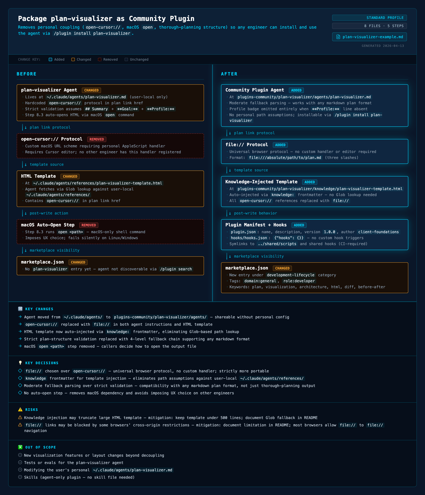

# Plan Visualizer

Generates self-contained HTML visualizations from markdown implementation plans. Opens in any browser — shows BEFORE/AFTER architecture, diff-marked components (ADDED/CHANGED/REMOVED/UNCHANGED), key decisions, and risks.



## Installation

Add the marketplace to Claude Code:

```
/plugin marketplace add omril321/claude-plan-visualizer
```

Then install the plugin:

```
/plugin install plan-visualizer@claude-plan-visualizer
```

## Usage

Invoke the agent by asking Claude to visualize a plan:

```
Visualize the plan at plans/my-plan.md
```

## What It Does

1. **Reads the plan** — extracts goal, components, changes, decisions, and risks from markdown
2. **Classifies the layout** — chooses BEFORE/AFTER, BROKEN/FIXED, or CURRENT/TARGET framing based on plan content
3. **Generates HTML** — self-contained file with CSS animations, diff markup, and responsive layout
4. **Writes the output** — saves as `plan-basename.visualization.html` alongside the plan file
5. **Updates the plan** — adds a clickable `file://` link back to the visualization

## Output

A single self-contained HTML file with:
- Header with plan title, subtitle, scope badge, and link to source plan
- Change legend (Added / Changed / Removed / Unchanged)
- Side-by-side BEFORE / AFTER panels with flow-step components
- Bottom sections: Key Changes, Key Decisions, Risks (+ optional Out of Scope, Success Criteria)

## Plan Format

Works best with plans containing:
- `## Summary` with a `**Goal:**` line
- `**What changes:**` bullet list of files/components
- `**Key decisions:**` and `**Risks:**` sub-fields

Also handles plans without these sections via graceful fallback — the agent extracts the goal from the first heading or paragraph if a structured Summary is absent.

## When It Skips

The agent skips visualization when the plan:
- Has fewer than 3 steps AND fewer than 3 files changed
- Is purely investigatory (no code/architecture changes)
- Is administrative only (staging commits, docs cleanup)

## Components

| Component | Purpose |
|-----------|---------|
| `plan-visualizer` agent | Reads plan markdown, generates HTML visualization |
| `knowledge/plan-visualizer-template.html` | HTML/CSS template skeleton used as the structural base |

## License

MIT
