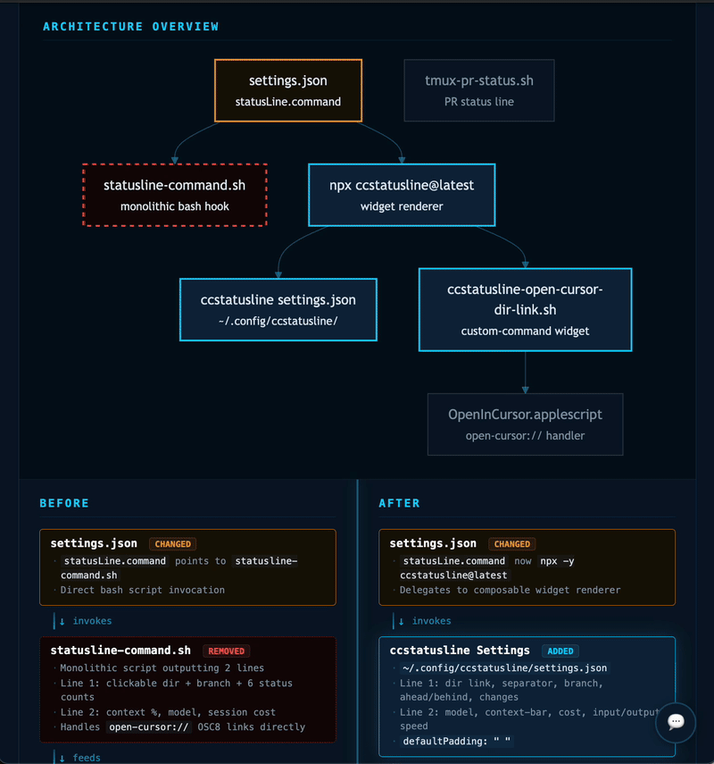

# Plan Visualizer

Generates HTML visualizations from markdown implementation plans. Opens in any browser — shows BEFORE/AFTER architecture with diff-marked components, mermaid architecture diagrams, key decisions, risks, and interactive feedback annotations.



## Installation

Add the marketplace to Claude Code:

```
/plugin marketplace add omril321/claude-plan-visualizer
```

Then install the plugin:

```
/plugin install plan-visualizer@claude-plan-visualizer
```

## Configuration

Create `~/.claude/plan-visualizer.json` to customize the URL protocol for plan file links:

```json
{"url_protocol": "open-cursor"}
```

Supported protocols: `file` (default), `open-cursor`, `vscode`, or any custom protocol handler.

If this file doesn't exist, the plugin defaults to `file://` links.

## Usage

Invoke the agent manually by asking Claude to visualize a plan:

```
Visualize the plan at plans/my-plan.md
```

Or use it programmatically from a planning skill by invoking the `plan-visualizer:plan-visualizer` agent with the plan file path.

## What It Does

1. **Reads config** — checks `~/.claude/plan-visualizer.json` for URL protocol preference
2. **Reads the plan** — extracts goal, components, changes, decisions, risks, steps, assumptions, and success criteria
3. **Classifies the layout** — chooses BEFORE/AFTER, BROKEN/FIXED, or CURRENT/TARGET framing
4. **Generates architecture diagram** — creates a mermaid diagram showing component relationships with diff-styled nodes (when plan has 3+ related components)
5. **Generates HTML** — file with CSS animations, diff markup, mermaid rendering, feedback system, and responsive layout
6. **Writes the output** — saves as `plan-basename.visualization.html` alongside the plan file
7. **Updates the plan** — adds a clickable link back to the visualization using the configured protocol

## Output

A single HTML file with:
- Header with plan title, subtitle, scope badge, and link to source plan (using configured protocol)
- Change legend (Added / Changed / Removed / Unchanged)
- Architecture overview diagram (mermaid, when applicable)
- Side-by-side BEFORE / AFTER panels with flow-step components
- Bottom sections (max 5, prioritized): Implementation Steps, Success Criteria, Key Changes, Key Decisions, Risks, Assumptions, In Scope, Out of Scope
- Interactive feedback system for plan review annotations

## Feedback System

The generated HTML includes an interactive annotation system:

1. **Select any text** on the visualization (headings, bullets, diagram labels)
2. **Add a comment** via the popover that appears near your selection
3. **Review collected feedback** by clicking the floating button (bottom-right)
4. **Copy structured feedback** to clipboard — formatted for pasting directly into the agent:

```
Feedback about the plan:
1. About `<selected text>`: <your comment>
2. About `<another selection>`: <your comment>
```

## Mermaid Diagrams

When a plan has 3+ components with relationships, the agent generates a mermaid architecture overview diagram showing:
- Component nodes with labels and file paths
- Dependency/flow arrows between components
- Diff-styled nodes: cyan border (added), orange border (changed), dashed red border (removed), dim border (unchanged)

Mermaid.js is loaded from unpkg CDN (requires internet connection).

## Plan Format

Works best with plans containing:
- `## Summary` with a `**Goal:**` line
- `**What changes:**` bullet list of files/components
- `**Key decisions:**` and `**Risks:**` sub-fields
- `## Steps` with `### Step N` headings and verify criteria
- `## Assumptions` and `## Success Criteria`
- `## Scope Definition` with In Scope / Out of Scope

Also handles plans without these sections via graceful fallback.

## When It Skips

The agent skips visualization when the plan:
- Has fewer than 3 steps AND fewer than 3 files changed
- Is purely investigatory (no code/architecture changes)
- Is administrative only (staging commits, docs cleanup)

## Components

| Component | Purpose |
|-----------|---------|
| `plan-visualizer` agent | Reads plan markdown, generates HTML visualization |
| `knowledge/plan-visualizer-template.html` | HTML/CSS/JS template with mermaid support and feedback system |
| `~/.claude/plan-visualizer.json` | User config file for URL protocol (outside plugin) |

## License

MIT
